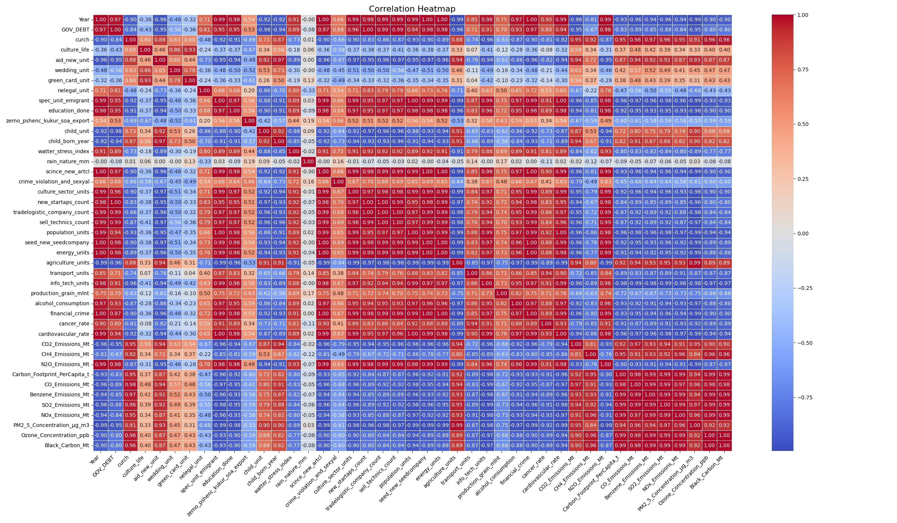

# Что такое функция ?
Это зависимость, одной величины X от, какой то другой величины Y. При каком то значении X, значение Y принимает определенное значение.

То есть буквально функция - это закон, по которому изменяются величины - значения. Y - значение функции, X - значение аргумента.

Самая простейшая функция - закон по которому вычисляются значения Y = X, значение функции равно значению ее аргумента.

Данный закон изменения можно записать более литературно f(x)=x 

f(x) - значение функции f(x) при аргументе x, равно Y.

То есть, если мы попытаемся составить таблицу ее значений - воспроизведем закон зависимости одной величины от другой, это будет выглядеть следующим образом:

|X|Y|
|-|-|
|3|3|
|7|7|
12|12|

Построим график:
<p align="center">
 
</p>
 

# Другие, более сложные функции.

<p align="center">
 
</p>

Функций превиликое множество, потому как зависимостей, те что подчиняются определенному закону, а не какие то случайные, в нашем мире очень много.

Как мы знаем нейросети способны обнаружить абсолютно любую зависимость, о них мы сейчас и поговорим.

# Моделирование функции

Простая функция, состоящая из набора точек Y = X прямая.

А что если представить функцию Y = X * w что мы получим ? w - некоторая случайная величина, просто величина которая не позволяет быть функции прямой, т.е нести прямопорпорциональную зависимость. *Сколько отработал - Столько и получил (пример ООО mshunko)*.

Допустим w это некоторая случайная величина которую мы будем исследовать, что бы составить ее закон и внести в протокол заседания нашего научного соощества формулу функции.

Давайте построим ее график

|X|w|Y|
|-|-|-|
|3|1.1|3.3|
|7|1.7|11.9|
|12|0.8|9.6|
|14|1.2|16.8|
|25|0.3|7.5|
|29|1.5|43.5|
|30|0.2|6|

Ее график

<p align="center">
 
</p>

Как мы видим прямую зависимость испоганили коэфициенты w. Что это за коэфициенты ? - какие то внешние факторы в 21 веке это Информационный поток (ИП). Будем называть данную функцией *моделируемой*.

# Что такое Информационный поток ?

Информационный поток - это вся та информация которая "производится", "потребляется" и "блуждает" в обществе. Она на прямую влияет на моральное состояние человека и может отыграть в нем различного рода расстройствами или психики, или соматики в случае если процент понимания ее невелик. Так нарушается семантическое представление о мире вокруг и поведение человека изменяется, он еще хочет но уже не может достигнуть своих целей. Это ставит разного рода преграды на жизненном пути, начинает болеть душа и тело, что выливается в произведения культуры (тот же информационный поток) в которых он желает, просит, умоляет о помощи. Понимание информационного потока позволяет "откликнуться" и оказать сколько нибудь значимую помощь.

# Языковые модели LLM/GPT.

Связующей точкой их функционирования является класификация данная человеческим мозгом различным явлениям окружающей среды. Они пологают что если мозг назвал красный сфетофор - красным, а зеленую траву зеленым то зеленое скорее пушистое, а красное больно.

# Модель GARCHAN-15

Пологает что язык доведет до абсурда если это потребуется, а как мы поняли это и требуется чему свидетельствует война на Украине.

# Справочно - как работает Перцептрон (по ООО mshunko)

Подключите воображение.

Возмем несколько моделируемых функций MF(x) = w*x . 

Это будет выглядеть как несколько изломанных прямых, уходящих по X.

Так вот перцептрон это частный случай, когда эти несколько моделируемых функций пологаю их в данном примере 3, в точке X, имеют такие значения что результатом является логическая операция над исходными точками этих функций.

Поздравляю Нас, мы свели во едино класическую математику и компьюторную арифметику (OR, XOR, AND) и судя по всему булевую алгебру (ПРАВДА (1), ЛОЖЬ (0)).

Позвольте всех Нас искренне поздравить, мы только что поняли что если из данных не убрать лишний ШУМ, они могут нас убить, что они и делают сейчас.

Спасибо, спасибо, спасибо, я тоже очень рад, ведь сейчас мир начнет меняться (О Боже, хоть бы не калапсировать) мы сможем избавлятся от раздражителей в общественном поле, просто отфильтровывая их поток из данных при обучении моделей, нейросети станут действительно помошниками в экономике и жизни общества, а не как сейчас губить нас без суда и следствия.

# Что дальше ?


Рассмотрим семью, состоящую из трёх человек, где:  
- $w_1$ — папа  
- $w_2$ — мама  
- $w_3$ — ребёнок  

## Жизненная ситуация

Мама и папа мечтают о ребёнке и его будущем.  
Чтобы ребёнок появился на свет:  
- Папа должен обладать мужеством, выдержкой, быть целеустремлённым  
- Мама — знать все премудрости воспитания ребёнка от рождения до его самостоятельности

### Условие появления ребёнка $w_3$

Папа должен пожертвовать собой — $\frac{1}{2}w_1$ (отдать частичку себя)  
Мама должна быть готова стать мамой — $2w_2$

Уравнение:

$$
\frac{1}{2}w_1 + 2w_2 = w_3
$$

### Взросление ребёнка

Папа обязан обеспечивать защиту для мамы и ребёнка, а также быть в состоянии предоставить им всё необходимое.  
Мама и ребёнок должны сохранить эту любовь.

Уравнение:

$$
\frac{w_1}{w_2 + w_3} = 1
$$

### Самостоятельность ребёнка

Ребёнок может справляться с ежедневными делами без помощи родителей и при этом не потерять себя.

Уравнение:

$$
w_3 - (w_2 + w_1) = 1
$$

## Система уравнений (1)

---

$$
\begin{cases}
\frac{1}{2}w_1 + 2w_2 = w_3 \\\\
\frac{w_1}{w_2 + w_3} = 1 \\\\
w_3 - (w_2 + w_1) = 1
\end{cases}
$$

---

Следствие:

- Когда ребенок рождается здоровым ? - когда соблюдаются условия системы уравнений (1).
- Когда ребенок рождается больным ? - когда общество в котором находится семья не в силах противостоять информационному потоку.
- Что если система не имеет решения с заданными коэфициентами? - ... наверно это разрушения окружающей обстановки т.е поиск корней для решения, если их не удается найти ... болезненная смерть.


Замечание: накопленный потенциал обналичивается в виде предметов мебели, уюта дома является своего рода аккомулятором дающим силу и энергию созидать.


Корни: $w_1=-3$ - папа, $w_2=-0.5$ - мама, $w_3=-2.5$ - ребенок. Есть наименьшие значения при которых моделируемая функция показывает жизнь. Тогда пологаю что изменение весов при обучении на заданную величину за один шаг и *убивает* в папе - папу, в маме - маму, в ребенке - ребенка, то есть нелинейность которой будет фонить субпродукт обучения будет ломать человека пока не убъет. Ломать - наверно пробуждать желания.


# Задача №1

Если обычный ML инженер ставит своей целью найти воронку продаж, ООО mshunko ставит своей целью найти всех лоботрясов, лентяев, лобистов, корупционеров проанализировав DataSet.

А где его взять ? (с) М. Задорнов.

## Зачем искать всех этих людей ?


<p align="center">
 
</p>


Рассмотрим базовую формулу оценки устойчивости общества к информационной нагрузке:

```
S = Σ(Pᵢ * wᵢ) * 2 + K
```

Где:

- **Pᵢ** — количество работников в профессиональной группе i (в тысячах)
- **wᵢ** — коэффициент устойчивости группы i к ИП (по шкале 1–4) (это и есть будущие корни системы уравнений)
- **2** — коэффициент пандемийного или стрессового усиления контактов
- **K** — количество детей (или иных незащищённых участников общества)

Пример (для Беларуси):

- 100 тыс. программистов \* 4 = 400 000
- 260 тыс. транспортников \* 3 = 780 000
- 50 тыс. энергетиков \* 2 = 100 000
- 250 тыс. аграриев \* 1 = 250 000
- K = 1 827 758 (дети)


```
S = ((400000 + 780000 + 100000 + 250000) * 2) + 1 827 758
S = (1 530 000 * 2) + 1 827 758 = 3 060 000 + 1 827 758 = 4 887 758
``` 

Сравнивая это значение с общим населением (\~9 млн), можно сделать вывод: **более половины населения подвержены избыточному ИП**.

**Система устойчивости семьи**
Семья — первичная ячейка устойчивости. Её можно описать через систему уравнений:

1. `(½)w₁ + 2w₂ = w₃` — рождение устойчивого ребёнка
2. `w₁ / (w₂ + w₃) ≤ 1` — баланс взросления
3. `w₃ ≥ w₁ + w₂` — самостоятельность

**Где:**
- w₁ — устойчивость отца
- w₂ — устойчивость матери
- w₃ — устойчивость ребёнка

Семья, удовлетворяющая этой системе, способна 'перевести' ребёнка из категории уязвлённых (K) в устойчивую (Pᵢ).

Причем тут работающие в информационной, энергетической, транспортной, культурной и сельскохозяйственной сферах ? Притом что так строился наш мир, эти профессии постепенно появлялись и в свое время являлись вершиной промышленного производства, т.е им отдавалась последнее для того что бы они работали, а они в свою очередь должны были помогать справляться с насущными проблемами общества, основной их задачей - я пологаю было переваривание информационного потока который в нем блуждал, потому как всё новое - это страшно, но когда «общественные когнентумы» обдуманы многими и переварены они не представляют опасности для окружающих. Когда то люди очень боялись и снега, и огня и воды, а теперь это лучший антистресс, потому как за свою жизнь человечесвто переварило их на столько что они уже не представляют опасниости. Что значит не представляют опасности ? Значит их появление в жизни человека не помешает ему, жизнь человека семантически правильно сложена, он точно знает чего хочет и знает как это сделать.

 
# Переведем всё описанную систему на продукты

Выпускаемый продукт обязан становится самостоятельным, что бы предприятие имело возможность выпускать обновленные версии и модификации.

На примере книги, книга, (написана одним писателем, выпускается множеством изданий - сферы работников V * $w_2$) , (читается массой людей - продано штук O * $w_3$ ), ( книга планировалась для людей определенного возраста (рынок) Z * $w_1$ ).

На примере телефона Android, (телефон выпускается множеством предприятий - сферы работников V * $w_2$ ), ( покупается и используется массой людей продукт - O * $w_3$ ), ( прогноз рынка телефоно на данный год составлял Z * $w_1$ )


Рассмотрим семью, состоящую из трёх человек, где:  
- $w_1$ — оценочно рынок данного продукта.
- $w_2$ — количество человек трудящихся на заданном рынке.
- $w_3$ — количество проданных штук.

Рассмотрим продукт Android.

В представленной таблице
- $X_1$ — Оценка рынка смартфонов для заданного года в млрд штук. 
- $X_2$ — Количесвто специалистов сферы Andorid в млрд. чел.
- $X_3$ — количество проданных штук в млрд штук.

Решаем систему матрично Ax = b.
 
Решаемо|Год|X1|X2|X3|1/2X1|2X2|Корень 1| Корень 2| Корень 3|
|-|-|-|-|-|-|-|-|-|-|
|True|2009|0.1734|0.000177835|0.007|0.0865|0.00035567|-17.26122|-2811.595018|-356.156502|
|True|2010|0.296|0.0002144|0.067|0.148|0.0004288|-10.135135|-2332.089552|-37.313433|
|True|2011|0.472|0.000254467|0.238|0.236|0.000508934|-6.355932|-1964.891322|-10.504202|
|True|2012|0.68|0.000289861|0.452|0.34|0.000579722|-4.411765|-1724.964724|-5.530973|
|True|2013|0.968|0.000333756|0.759|0.484|0.000667512|-3.099174|-1498.100409|-3.293808|
|True|2014|1.3|0.0003726|1.053|0.65|0.0007452|-2.307692|-1341.921632|-2.374169|
|False|2015|1.424|0.000387814|1.162|0.712|0.000775628|~-2.106742|~-1289.27785|~-2.151463|
|True|2016|1.473|0.000381053|1.247|0.7365|0.000762106|-2.03666|-1312.153427|-2.004812|
|False|2017|1.472|0.00040111|1.25|0.736|0.00086222|~-2.139664|~-1246.540849|~-2.119668|
|False|2018|1.404|0.000408771|1.19|0.702|0.000817542|~-2.136752|~-1223.178748|~-2.10084|
|True|2019|1.373|0.000396899|1.165|0.6865|0.000793798|-2.184996|-1259.766339|-2.145923|
|True|2020|1.29|0.000403301|1.084|0.645|0.000806602|-2.325581|-1239.768808|-2.306273|
|True|2021|1.364|0.0004235|1.142|0.685|0.000847|-2.209131|-1180.637544|-2.200748|
|False|2022|1.21|0.000740774|1.004|0.605|0.001481548|~-2.479339|~-674.969694|~-2.49004|
|True|2023|1.142|0.000731129|0.877|0.571|0.001462258|-2.62697|-683.873844|-2.850627|
|False|2024|1.223|0.000744496|1.488992|0.6115|0.00093|~-1.839057|~-671.595281|~-1.174732|
|True|2025|1.24|0.000747203|0.93|0.62|0.001494406|-2.419355|-669.162196|-2.688172|

Рассмотрим продукт Транспортные средства.

Решаемо|Год|X1|X2|X3|1/2X1|2X2|Корень 1|Корень 2|Корень 3|
|-|-|-|-|-|-|-|-|-|-|
|True|2009|0,0617|0,008367|0,0617|0,03085|0,016734|-48,622366|-59,759336|-48,622366|
|True|2010|0,0617|0,010179|0,07506|0,03085|0,020357|-48,622366|-49,122715|-48,622366|
|False|2011|0,07506|0,010604|0,0782|0,03753|0,021209|~-39,968026|~-47,150268|~-39,968026|
|True|2012|0,084456|0,011147|0,0822|0,042228|0,022294|-35,521455|-44,85585|-35,521455|
|True|2013|0,088776|0,01159|0,08547|0,044388|0,02318|-33,792917|-43,139708|-33,792917|
|True|2014|0,092308|0,011956|0,088165|0,046154|0,023911|-32,500033|-41,821198|-32,500033|
|True|2015|0,095218|0,012161|0,08968|0,047609|0,024322|-31,50671|-41,114528|-31,50671|
|True|2016|0,096842|0,012689|0,09357|0,048421|0,025377|-30,978298|-39,405267|-30,978298|
|True|2017|0,0994|0,013127|0,0968|0,0497|0,026253|-30,181226|-38,090402|-30,181226|
|False|2018|0,102165|0,01289|0,095056|0,051083|0,02578|~-29,364244|~-38,789277|~-29,364244|
|True|2019|0,10266|0,012485|0,092065|0,05133|0,024969|-29,22256|-40,04932|-29,22256|
|True|2020|0,09943|0,010804|0,079669|0,049715|0,021607|-30,171835|-46,281086|-30,171835|
|True|2021|0,086042|0,011342|0,083638|0,043021|0,022684|-34,866642|-44,084416|-34,866642|
|False|2022|0,090329|0,011253|0,082986|0,045165|0,022507|~-33,211744|~-44,431117|~-33,211744|
|False|2023|0,089625|0,012591|0,09285|0,044812|0,025182|~-33,472936|~-39,71081|~-33,472936|
|True|2024|0,094379|0,012925|0,095315|0,04719|0,025851|-31,786583|-38,683958|-31,786583|
|True|2025|0,095768|0,013154|0,097|0,047884|0,026308|-31,325664|-38,011865|-31,325664|

Рассмотрим продукт Вычислительная техника

Решаемо|Год|X1|X2|X3|1/2X1|2X2|Корень 1| Корень 2| Корень 3|
|-|-|-|-|-|-|-|-|-|-|
|True|2009|0.306|0.000918|0.306|0.153|0.001836|-9.803922|-544.662309|-8.169935|
|True|2010|0.306|0.0010386|0.3462|0.153|0.0020772|-9.803922|-481.417293|-7.221259|
|True|2011|0.3462|0.0010572|0.3524|0.1731|0.0021144|-8.665511|-472.947408|-7.094211|
|True|2012|0.381266667|0.001047|0.349|0.1906333335|0.002094|-7.868508|-477.554919|-7.163324|
|False|2013|0.3722|0.000948|0.316|0.1861|0.001896|~-8.060183|~-527.42616|~-7.911392|
|True|2014|0.34076|0.0009075|0.3025|0.17038|0.001815|-8.80385|-550.964187|-8.264463|
|True|2015|0.317533333|0.005417|0.289|0.1587666665|0.010834|-9.447827|-92.302012|-8.650519|
|False|2016|0.298042857|0.0008265|0.2755|0.1490214285|0.001653|~-10.065666|~-604.960678|~-9.07441|
|True|2017|0.280528571|0.000786|0.262|0.1402642855|0.001572|-10.694098|-636.132316|-9.541985|
|True|2018|0.264172222|0.0008511|0.2837|0.132086111|0.0017022|-11.356228|-587.475032|-8.812125|
|True|2019|0.262626667|0.0009162|0.3054|0.1313133335|0.0018324|-11.423059|-545.732373|-8.185986|
|True|2020|0.280968|0.0009813|0.3271|0.140484|0.0019626|-10.677373|-509.528177|-7.642923|
|True|2021|0.300932|0.0010464|0.3488|0.150466|0.0020928|-9.96903|-477.828746|-7.167431|
|True|2022|0.320896|0.000858|0.286|0.160448|0.001716|-9.348823|-582.750583|-8.741259|
|True|2023|0.2932|0.0007269|0.2423|0.1466|0.0014538|-10.231924|-687.852524|-10.317788|
|True|2024|0.26653|0.0007359|0.2453|0.133265|0.0014718|-11.255769|-679.440141|-10.191602|
|True|2025|0.2656925|0.0007359|0.2453|0.13284625|0.0014718|-11.291248|-679.440141|-10.191602|

## Выводы

Что мы видим, что в года когда система не имела решения начинались конфликты или происходила болезненная смерть.

2011 - Стив Джобс

2015 - война в Сирии

2018 - год катастроф техногенного характера

2022 - война на Украине

Осмелюсь предположить если в *хаосе* 2011 виновные автогиганты, то в войне на Сирии и Украине виноват Google.

На подходе нейросети и ML инженеры ... на них вся надежда ... то есть вся эта индустрия сейчас творит историю которой мы будем жить ближайшие лет 5 лет.

Что не учтено ? как повышаются эти самые качества благодоря продуктам.

### Следствие

Биг-Дата фонящая нелинейностью забирает у людей очень много жизненного ресурса, это связано с тем что алгоритмы обучения и подбора весов, супер и гипер параметры не учитывают:

Представим все слои обучаемой нейросети как функции y = k*x + b , получится что то вроде вееров функций, которые имеют точки пересечения, точка пересечения не всегда катастрофа, но такое тоже может быть. Точка пересечения может нести и выгодную сделку и покупку дома, но ей могут предшествовать смерть или увечья. Смысл не во времени наступления обстоятельств смерти или увечий, а их избегания на это тратится ресурс мозга. Расход которого постоянно увеличивается, что бы сохранить организм целым и невредимым. Модели и их алгоритмы обучения должны контролироваться органами власти.

<p align="center">
 
</p>

Вееры функций.


Шунько Михаил Геннадьевич 17 октября 2025 г.

Отредактировано 24.10.2025 г.

