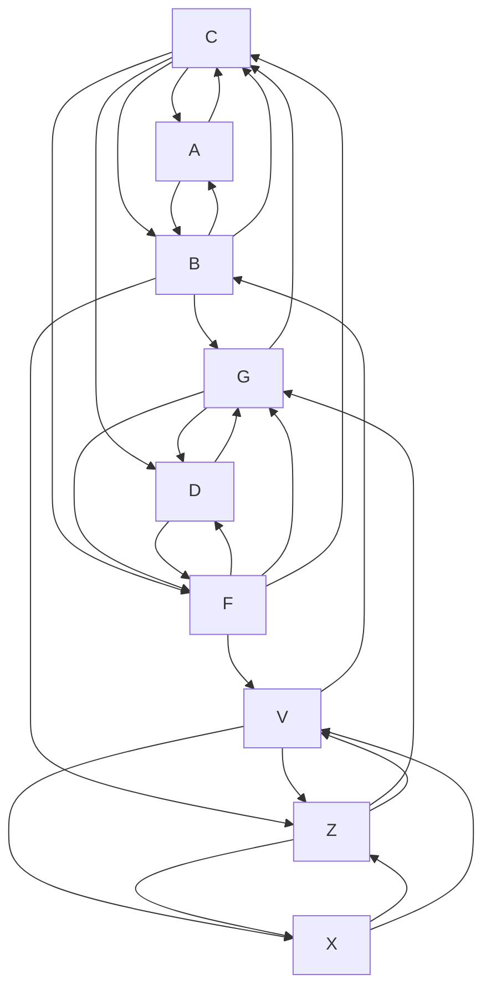

Здравствуйте, меня зову Шунько Михаил. Я инжене-программист, обучался в Белорусском Национальном Техническом Университете (2012г.) на факультете информационных технологий и робототехники. Мне 39 лет, живу в п. Дружный.

Наблюдая за геополитической обстановкой с медиа-экранов становится страшно за наше будущее, страх войны не покидает меня поледний год, события развиваются в том же ключе что и перед Второй Мировой. Я думаю мои наблюдения и некоторый анализ, может помочь нам всем справится, и побороть этот страх. Справляться с насущными проблемами, все сложнее и сложнее.

---

**Название:**
Информационное перенасыщение и устойчивость социальных и производственных систем: математико-социологическая модель

**Автор:** Шунько М.Г.

---

**Аннотация**

В работе предлагается оригинальный подход к оценке устойчивости семейных, социальных и производственных систем к информационному перенасыщению. Представлена система уравнений, моделирующая динамику развития семьи и аналогично — жизненный цикл продукта на предприятии. Вводится формула устойчивости, позволяющая количественно оценить перегрузку специалистов и регионов. Предлагается концепция "лекального" применения моделей для анализа профессионального выгорания, деградации устойчивости и рисков банкротства. Модель имеет как теоретическое, так и прикладное значение для проектирования информационных систем поддержки принятия решений, включая платформы бизнес-аналитики нового поколения (Business Intelligence).


# 1. Обзор состояния вопроса.

Всю свою жизнь человечество избавляло себя от раздражителей, в макро представлении это согласованное постепенное избавление от стресса вызванного влиянием окружающей природы. Исследование окружающей среды ведется каждым, подход к исследованию системный, порог принятия решения - опасность которую невозможно миновать. По этому когда система ломается, общество начинает скорбить, ведь травма, которая наносится окружающей обстановкой болит и начинает кровоточить. Для того что бы избежать слома, принимаются законы и кодексы которые регулируют взаимоотношения в обществе, дают границы и ориентиры в которых гарантируется спокойствие. Благодоря им раздражители реже просачиваются в общественное поле. То есть получается закон принимается в придверии катастрофы или после нее.

Главной проблемой современности является информационный поток - это вся та информация которая "производится", "потребляется" и "блуждает" в обществе. Она на прямую влияет на моральное состояние человека и может отыграть в нем различного рода расстройствами или психики, или соматики в случае если процент понимания ее невелик. Так нарушается семантическое представление о мире вокруг и поведение человека изменяется, он еще хочет но уже не может достигнуть своих целей. Это ставит разного рода преграды на жизненном пути, начинает болеть душа и тело, что выливается в произведения культуры (тот же информационный поток) в которых он желает, просит, умоляет о помощи. Понимание информационного потока позволяет "откликнуться" и оказать сколько нибудь значимую помощь.

## 1.1 Модель взросления ребенка

Рассмотрим семью, состоящую из трёх человек, где:  
- $x_1$ — папа  
- $x_2$ — мама  
- $x_3$ — ребёнок  

Жизненная ситуация

Мама и папа мечтают о ребёнке и его будущем.  
Чтобы ребёнок появился на свет:  
- Папа должен обладать мужеством, выдержкой, быть целеустремлённым  
- Мама — знать все премудрости воспитания ребёнка от рождения до его самостоятельности

Условие появления ребёнка $x_3$

Папа должен пожертвовать собой — $\frac{1}{2}x_1$ (отдать частичку себя)  
Мама должна быть готова стать мамой — $2x_2$

Уравнение:

$$
\frac{1}{2}x_1 + 2x_2 = x_3
$$

Взросление ребёнка

Папа обязан обеспечивать защиту для мамы и ребёнка, а также быть в состоянии предоставить им всё необходимое.  
Мама и ребёнок должны сохранить эту любовь.

Уравнение:

$$
\frac{x_1}{x_2 + x_3} = 1
$$

Самостоятельность ребёнка

Ребёнок может справляться с ежедневными делами без помощи родителей и при этом не потерять себя.

Уравнение:

$$
x_3 - (x_2 + x_1) = 1
$$

Система уравнений (1)

---

$$
\begin{cases}
\frac{1}{2}x_1 + 2x_2 = x_3 \\\\
\frac{x_1}{x_2 + x_3} = 1 \\\\
x_3 - (x_2 + x_1) = 1
\end{cases}
$$

---


Пологая что семья не изолирована от остального мира, а ребенок самый уязвимый в этой системе, предположим что он приносит в дом некоторую тревожность, воспринимая ее с улицы или с медиа экранов. Его тревожность вызывает в семье серьезные разговоры, нравоучения, а так же скандалы - если сил противостоять тревожности у семьи нет. 

Семья 1 - A - папа B - мама C - ребенок

Семья 2 - D - папа F - мама G - ребенок

Семья... - Z - папа X - мама V - ребенок


Диаграмма (I)

Пологая что, восприятие изменяет личностные качества ребенка, что отыгрывает в понижении или увеличении его "самостоятельности", т.е изменяет коэфициент $x_3=-2.5$ радость - в плюс, или ошарашенность - в минус. Решаем систему уравнений заново, с заранее известным $x_3$. Пологая что данная семья непрерывно участвует в жизни страны и находится в обществе таких же семей имеем модель представления о влиянии, распространении, информационного потока (Диаграмма (I)). Замечание: накопленный потенциал обналичивается в виде предметов мебели, уюта дома является своего рода аккомулятором дающим силу и энергию созидать.

Следствие:

- Когда ребенок рождается здоровым ? - когда соблюдаются условия системы уравнений (1).
- Когда ребенок рождается больным ? - когда общество в котором находится семья не в силах противостоять информационному потоку.
- Что если система не имеет решения с заданными коэфициентами? - ... наверно это разрушения окружающей обстановки т.е поиск корней для решения, если их не удается найти ... болезненная смерть.

## 1.2 Простая модель ИП-перенасыщения. 

Рассмотрим базовую формулу оценки устойчивости общества к информационной нагрузке:

```
S = Σ(Pᵢ * Cᵢ) * 2 + K
```

Где:

- **Pᵢ** — количество работников в профессиональной группе i (в тысячах)
- **Cᵢ** — коэффициент устойчивости группы i к ИП (по шкале 1–4) (это и есть будущие корни системы уравнений)
- **2** — коэффициент пандемийного или стрессового усиления контактов
- **K** — количество детей (или иных незащищённых участников общества)

Пример (для Беларуси):

- 100 тыс. программистов \* 4 = 400 000
- 260 тыс. транспортников \* 3 = 780 000
- 50 тыс. энергетиков \* 2 = 100 000
- 250 тыс. аграриев \* 1 = 250 000
- K = 1 827 758 (дети)


```
S = ((400000 + 780000 + 100000 + 250000) * 2) + 1 827 758
S = (1 530 000 * 2) + 1 827 758 = 3 060 000 + 1 827 758 = 4 887 758
``` 

Сравнивая это значение с общим населением (\~9 млн), можно сделать вывод: **более половины населения подвержены избыточному ИП**.

**Система устойчивости семьи**
Семья — первичная ячейка устойчивости. Её можно описать через систему уравнений:

1. `(½)x₁ + 2x₂ = x₃` — рождение устойчивого ребёнка
2. `x₁ / (x₂ + x₃) ≤ 1` — баланс взросления
3. `x₃ ≥ x₁ + x₂` — самостоятельность

**Где:**
- x₁ — устойчивость отца
- x₂ — устойчивость матери
- x₃ — устойчивость ребёнка

Семья, удовлетворяющая этой системе, способна 'перевести' ребёнка из категории уязвлённых (K) в устойчивую (Pᵢ).

Причем тут работающие в информационной, энергетической, транспортной, культурной и сельскохозяйственной сферах ? Притом что так строился наш мир, эти профессии постепенно появлялись и в свое время являлись вершиной промышленного производства, т.е им отдавалась последнее для того что бы они работали, а они в свою очередь должны были помогать справляться с насущными проблемами общества, основной их задачей - я пологаю было переваривание информационного потока который в нем блуждал, потому как всё новое - это страшно, но когда «общественные когнентумы» обдуманы многими и переварены они не представляют опасности для окружающих. Когда то люди очень боялись и снега, и огня и воды, а теперь это лучший антистресс, потому как за свою жизнь человечесвто переварило их на столько что они уже не представляют опасниости. Что значит не представляют опасности ? Значит их появление в жизни человека не помешает ему, жизнь человека семантически правильно сложена, он точно знает чего хочет и знает как это сделать.

---


# 2. Производственная интерпретация: устойчивость специалистов

Формула $S$ применяется к предприятиям:

\$[
S = \left( \sum P_i \cdot C_i \right) \cdot 2 + K
\$]

Где $K$ — количество единиц поддерживаемой продукции. Устойчивость снижается по мере усложнения линейки продуктов. Если сотрудники не справляются — наступает выгорание, текучка, деградация качества, банкротство.

Система уравнений (1) в этом контексте:

1. $(\frac{1}{2})x_1 + 2x_2 = x_3$ — запуск продукта;
2. $\frac{x_1}{x_2 + x_3} \leq 1$ — поддержка продукта;
3. $x_3 \geq x_1 + x_2$ — его автономность.

---

# 3. Эмпирическая проверка и карта ИП

Кластеризация данных по профессиональной принадлежности и психоэмоциональной устойчивости (на примере США) показала корреляцию между профессией, перегрузкой и рисками. В других странах такие данные затруднительно собрать из-за закрытых баз.

Проектируется ИС, отображающая на карте регионы с наибольшими признаками перегрузки. Используется кросс-анализ с данными МКБ, продаж алкоголя, обращений к психиатрам, жалоб на труд. Это позволяет идентифицировать угнетающие предприятия и группы риска.

---
# 4. Перспектива применения в системах бизнес-аналитики (BI)

Разработанная модель применима как расширение возможностей систем Business Intelligence (BI), предлагая новую парадигму прогнозирования и планирования, основанную на устойчивости человеческого ресурса.

### Ключевые формулы

1. **Формула оценки устойчивости:**

\$[
S = \left( \sum_{i} P_i \cdot C_i \right) \cdot F + K
\$]

Где:
- \$P_i\$ — численность сотрудников в профессиональной группе $i$ на предприятии;
- \$C_i\$ — коэффициент устойчивости группы $i$ (вычисляется на основе статистики выгорания, текучести, больничных);
- \$F\$ — коэффициент внешнего давления (например, пандемия, релиз, регламент); обычно $F=2$;
- \$K\$ — объём поддерживаемой или выпущенной продукции (в условных единицах).

Интерпретация: чем выше $S$, тем выше **нагрузка на систему**. BI-система может отслеживать рост $S$ и сигнализировать о приближении к критическому уровню.

2. **Система уравнений жизненного цикла продукта:**

$$
\begin{cases}
\frac{1}{2}x_1 + 2x_2 = x_3 \\
\frac{x_1}{x_2 + x_3} = 1 \\
x_3 - (x_1 + x_2) = 1
\end{cases}
$$

Где:
- $x_1$ — усилия технической команды;
- $x_2$ — усилия менеджмента и поддержки;
- $x_3$ — зрелость и автономность продукта, продуктов, выпущенных единиц.

Интерпретация: если условия выполнены, BI может прогнозировать переход продукта в фазу снижения операционных издержек.

### BI-возможности:

- **Прогнозирование ресурсной нагрузки**: формула \$S\$ позволяет оценивать пределы допустимой нагрузки на специалистов.
- **Оптимизация кадровой политики**: на основе динамики \$x_i(t)\$ можно моделировать сценарии текучести.
- **Оценка жизненного цикла продукта**: система уравнений позволяет выявить, на каком этапе продукт нуждается в усиленной поддержке.
- **Интеграция внешних индикаторов**: BI получает дополнительный уровень аналитики через кросс-анализ с внешними данными (МКБ, демография, культура).

Таким образом, BI-система на основе предложенной модели становится не просто инструментом аналитики, а интеллектуальной архитектурой стратегического предвидения с учётом человеческого фактора.

---

# 5. Заключение

Представленные модели позволяют оценивать устойчивость как в семьях, так и на предприятиях. Формула $S$ и система уравнений (1) применимы как "лекало" в проектировании ИС-решений. Предложенный подход может стать основой для систем мониторинга и поддержки принятия решений в социально-экономической политике, а также в системах Business Intelligence нового поколения.

---

**Ключевые слова:** информационное перенасыщение, устойчивость, семья, предприятие, математическая модель, ИП, социальная когнитивная нагрузка, бизнес-аналитика, BI
