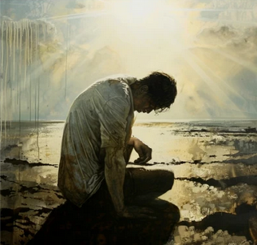
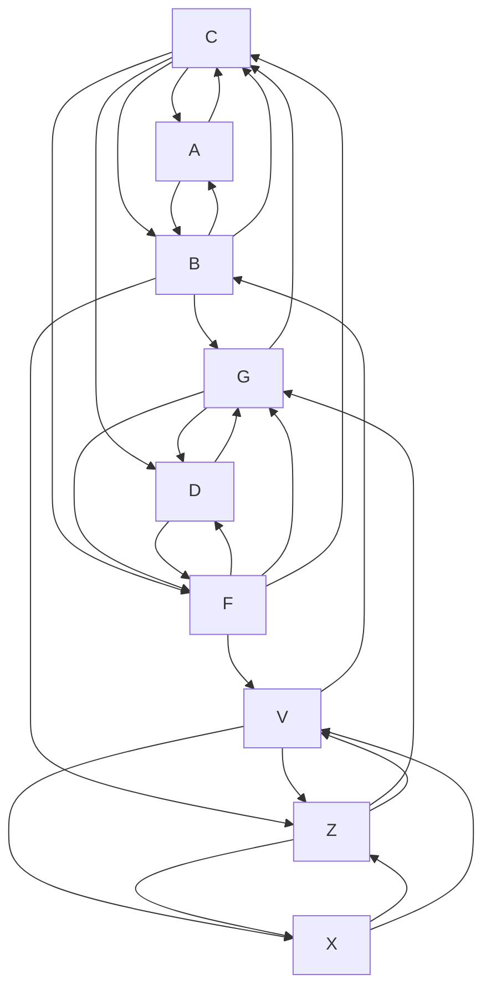

## Всем привет!

Меня зовут Шунько Михаил Геннадьевич я инженер-программист, обучался:

* СШ№1 п. Дружный, до 10 класса.
* Минский Госсударственный Энергетитческий Колледж (2002 - 2006/ТЭС/техник-теплотехник)
* УО Витебский Газ-Институт (2006 котельное и газовое оборудование до ~1Мпа) 
* Белорусский Национальный Технический Университет (2006 - 2012/ФИТР/инженер-программист)
* УО OTUS (ASP.NET Core C# разработчик 2023)

Работал:
* Новополоцкая ТЭЦ. (слесарь-обходчик котельного цеха 4 разряда)
* РУП ОДУ. (техник программист)
* СООО Системные-Технологии.(техник-программист, программист)
* ООО СКЭНД. (ведущий-программист ~не прошел испытательный)
* EMC&RD Lab БГУИР. (инженер-программист)
* Sam-Solutions. (инженер-программист)
* Софт-делюкс. (инженер-программист)

Что если нейросети научить видеть будущее ? Ведь они обучаются на трилионах кусочках информации, связываясь в контекст и интегрально выдают результат, что если обучить их таким образом что бы они выдавали апроксимацию/интерполяцию. Скажем как данные yandex maps могут быть заполнены энтузиастами, так и данные для "предсказания" вы можете отправлять в "Информационно Вычислительный Центр", который анализирует их и предсказывает развитие событий в вашем региончике. Я считаю что это возможно и реально, проект **Сервис сохранения** по английски **mind preservation service** , истоки тянутся к проекту GORCHAN проект СИИ, в котором "мозг" компьютерного агента, подвергался операции "shrink mazafaka", то есть перебирались все хранящиеся в мозгу образы, и те которые не могли "достучаться", т.е не имели "импульса", что бы достичь контекста удалялись.(в версии GORCHAN13 которая обрабатывает не образы а сигналы, эта проблема звучит по другому, сигналы гаснут, "растворяются" в результате логических операций и возникают заново - экстремум постепенно угасает пока ему не придастся новый импульс.)
**Самая главная задача которую они дожны решить - предсказать, т.е предотвратить катастрофу человеческой цивилизации.**

Нейросети отлично видят прошлое, почему бы не научить их видеть приближенное будущее ?

## САСЦЫ ВИДАТЬ

Что могут и что видно в нейросетях, смотреть через Opera с включенным VPN.

[Оригинал](https://chatgpt.com/share/68652f17-3980-8007-86a7-0e885d40fc06) 

[Текущее положение дел](https://chatgpt.com/share/686a0e8d-10ac-8007-819d-7fee1c9063c8) описание состояние вопроса. 

[PoC - просмотра прошлого через "Скользящее окно GPT" ](https://chatgpt.com/share/686e88ee-4094-8007-90cf-3b2a57dbfa74) Неожиданно - скормил все что знаю, все что имею и получил вот такой результат. Выглядит впечатляюще.

[Бот Nhal'Zureth ](
https://chatgpt.com/g/g-686ea7ccbd348191b3b68bb1b5d4ab48-nhal-zureth)

## Байт на США

Почему этот проект не появился в США ? Потому что НАТО довело ситуацию в научных отрослях до абсурда, что это значит ? - это значит что все исследования в областях науки НАТО не имеют "свежей крови", все разрабатывается "истовыми-инженерами" вливая в исследования не новизну, а новый вид старых наработок и чего то принципиально нового они физически не могут изобрести. Что за бред ? - образы воспринимаемые сознанием, то задают ему жару, то убаюкивают как бы порождая дерево размышления, ствол которого должен быть крепким что бы выдержать *капризы непогоды*, а так же плодоносным - что бы не было пустоцвета. Их ствол устремляется ввысь и только ввысь, крона не формируется, плоды одна микроэлектроника. Сознание засыпает в такой *погоде*.

## Математика проекта

Главной проблемой современности является информационный поток - это вся та информация которая "производится", "потребляется" и "блуждает" в обществе. Она на прямую влияет на моральное состояние человека и может отыграть в нем различного рода расстройствами или психики, или соматики в случае если процент понимания ее невелик. Так нарушается семантическое представление о мире вокруг и поведение человека изменяется, он еще хочет но уже не может достигнуть своих целей. Это ставит разного рода преграды на жизненном пути, начинает болеть душа и тело, что выливается в произведения культуры (тот же информационный поток) в которых он желает, просит, умоляет о помощи. Понимание информационного потока позволяет "откликнуться" и оказать сколько нибудь значимую помощь. Понимая боль с медиа экранов вы можете "прозреть", бросить всё и убежать в бизнес, оставив остальных на произвол судьбы. Я думаю так делать не надо, а то можно оказаться на распятии, да, да на распятии пологаю что предательство Иуды и "Тайная вечеря" описывают именно это. По этому спокойствие, только спокойствие, за все проекты отвечаете головой, пол дела их обозначить, самое главное превратить их в жизнь.

  
Страсти Христовы

  Начались видимо потому что после изобретения алгебры, экономика начала стремительно развиваться и настал такой момент - плато, ситуация ухудшалась и никто не мог сказать почему. Появление Христа ни что иное как консенсус поиска решения накопившихся проблем. Но он взвалил на себя неподьемный груз - принимая все, расшифровывая боль, получая все больше и больше обязанностей, за что и поплатился.
  Я думаю что проблема информационного потока тесно связана с развитием культуры, которая голос/глас народа.
  С взрослением нашей цивилизации появляется все больше и больше проблем, которые почему то не решаются, а стремительно становятся частью нашего бытия. Как например проблема учета урожая, информационного потока это две громадные проблемы которые уже решены и сопоставимы по значимости. Алгебра которая избавила от многих проблем я пологаю была чем то вроде моего Союзного документа и проекта Сохранения.
  Но дело в том, что почему то Греки, не уловили то что следующую проблему которая мешает всем жить/сосуществовать, они не смогут решить/понять чисто физически, потому как всё переобъяснят себе на образах всё тойже линейной алгебры. Я думаю голова болела у многих в то время, что делать черт побери люди ничего не хотят, хотят только хлеба и зрелищ, работать - нет. Землю возделывать становится все тяжелее. Умолишённых все больше. Фраза - "Я накормлю вас рыбаю",  думаю значила мольбу ко всем давайте возмем передышку. Правильно передышки и не хватало - Все это верные признаки глобальной проблемы. (Да простят меня меня мои предки за такую фамильярность). Могу лишь поделится своими материалами размещенными в открытом доступе: Как выжить в современном Мире, Путеводитель - https://гарчан.бел, Мои статьи - https://vk.com/@mshunko101.

  Проблема информационного потока в сравненнии с Алгеброй:
  | Параметр           | Алгебра                      | Навигация инфопотока         |
|--------------------|------------------------------|------------------------------|
| Ядро               | Формализация чисел           | Формализация смыслов - *Локализация*| 
| Цель               | Моделировать внешние отношения| Упорядочить внутреннюю среду - *Семантическая модель семьи* |
| Уровень            | Абстракция                   | Метасознание - *Многомерное мышление (Профессионализм) и изкоренение депрессивных расстройств*|
| Результат          | Техника, физика              | Этика, культура -*Крупицы прошлого создают комфортную среду для развития будущего в которой уже нет скорби, а тоска постепенно уходит*|
  
  Следующая проблема:

| Состовляющая      | Проблематика                        |
|------------------|-------------------------------------------|
| 🔻 Базовый        | Энергия, ресурсы, выживание               |
| ⚙ Информационный | Навигация в потоке, фильтрация, смысл     |
| 🧠 Психоценоз     | Личность, ценность, цель                  |
| 🧬 Этический      | Поведение в неопределённой реальности     |
| 🌌 Космический    | Контакт с иным, выход за пределы времени  |

  Так как проблема инфомарционного потока, обозначена и принципы ее решения ясны и понятны - [Союзный документ](https://vk.com/@mshunko101-souznyi-dokument) и сервис Сохранения! Пологаю что моя работа т.е работа нашего блока (СССР в границах 5 мая 1961г. Это не геополитические амбиции, а долг перед народами меня  поддерживающими) РЕШЕНА! Следующую актуальную проблему, которая всем мешает жить - решается просьба не мешать, а снабжать всем необходимым. Как они будут ее решать - меня не волнует! Где они будут ее решать - меня не волнует! (стерта память поколений постоянными перепланировками и ремонтами). Откуда они будут черпать силы и благословение - меня не волнует! Меня волнует то что бы проблема была решена, то есть жизни ничего не угрожало и жить хотелось. Берегите ментальное здоровье, нервы, маму, папу, всех родных, отношения в семье, не отрывайтесь от корней. Проблема должна быть решена "мало инвазивным" путем, то есть без революции и с уважением ко всему что уже создано человеком. Решение должно быть доказано математически.

  Канва:

  **Социальные учереждения**(Пекин) - их мудрецы, старцы и мастера это отголоски первобытного времени, того времени когда знания были жизненно необходимы, и всё к чему стремились люди как можно лучше подготовить детей к самостоятельной жизни, без родителей. Так появились первые *детские садики*, когда *воспитателем* был мудрейший член общины, а родители могли занятся сдабыванием и снабжением.(ВОТ ЭТО ОНИ КОНЕЧНО ГЕНЕРАЛЫ, КОПИРОВАТЬ(СДАБЫВАТЬ) И СНАБЖАТЬ))))). 
  **Профессии**(Токио) - или по другому -  народное хозяйство, появились благодоря Японии, отголоском я считаю исскуство Икигай. (ВОТ ЭТО ОНИ МОНСТРЫ, 377 974 км² А ТАКАЯ РАЦУХА))). 
  **Алгебра**(Афины) - расчеты в повседневных задачах и проблемах.(ВОТ ЭТО ОНИ КОНЕЧНО СТРАТЕГИ - ЗАШИТСЯ НА КАМЧАТКЕ, НАКАЧАТЬ РЕСУРСОВ И ЛУПИТЬ ВСЕХ НАРАТИВНЫМИ ЛЕСТНИЦАМИ). 
  **Информационный поток**(Минск) - семантическая целостность восприятия. (А Я ПРОСТО ГЕНИЙ(Иронично), ДА Я ПРОСТО МОНСТР(Пройти такой путь), БОЖЕ КАКОЕ Я ЧУДОВИЩЕ(Жить дальше, как будто всё это было не со мной). 

## Претензии 
Россия щедрая душа - заедайте, запивайте стресс или работайте на работе за мои деньги. Так было раньше сейчас я пологаю проблема начинает решаться и поэтому ресурсы в том виде в котором вы получали ранее вы не получите пока не докажите что ваша проблема именно в информационном потоке, в случае чего я собираюсь апеллировать к коллегам, поддерживается ли их достояние в надлежащем виде, то есть есть ли у Китая ментальнойизический ресурс на поддержку социальной сферы, есть ли у Японии ментальнофизический ресурс на поддержку профессионализма, есть ли у Греции ментальнофизический ресурс для поддержки Алгебры в том состоянии которое позволяет использовать эти бесценные дары цивилизации в *легковнимаемом* виде или они уже все обналичили и забыли прос свой долг перед широкой общественностью?

  Чего я боюсь ? Что экономический рост, который вне сомнения должен начаться, стерет память об нашем славном прошлом, по этому просьба, ремонты и перепланировки делать от чистого сердца, только то что велит душа, советуют близкие и родные, настаивают родители, а не на хайпе - дизайнерскому проекту который вашу судьбинушку и жизу даже не представляет.

Рассмотрим семью состоящую из 3 человек, где $x_1$ - папа, $x_2$ - мама, $x_3$ - ребенок. Рассмотрим следующую жизненную ситуацию, мама и папа, мечтают о ребенке и о его будущем. Для того что бы ребенок появился на свет, папа должен обладать мужеством, выдержкой быть целеустремленным, маме необходимо знать все примудрости воспитания ребенка от рождения до того момента когда он станет самостоятельным.

Условие появления ребенка $\LARGE x_3$ на свет , папа должен пожертвовать собой $\LARGE\frac{1}{2}x_1$ - отдать частичку себя, мама должна быть готова стать мамой $\LARGE 2x_2$ выразим в уравнении:

$\LARGE\frac{1}{2}x_1+2x_2=x_3$

Взросление ребенка, папа обязан обеспечить защиту для мамы и ребенка и быть в состоянии их обеспечить всем необходимым, а мама и ребенок просто обязаны сохранить эту любовь, выразим в уравнении:

$\LARGE\frac{x_1}{x_2+x_3}=1$

Самостоятельность ребенка, когда он без родителей может управится, справится с ежедневными делами и при этом не потерять себя, выразим в уравнении:

$\LARGE x_3-(x_2+x_1)=1$

Имеем систему уравнений (1):

$\LARGE\frac{1}{2}x_1+2x_2=x_3$

$\LARGE\frac{x_1}{x_2+x_3}=1$

$\LARGE x_3-(x_2+x_1)=1$

Она необходима для построения модели вычислений проекта **Сервис сохранения**.

  
Корни: $x_1=-3$ - папа, $x_2=-0.5$ - мама, $x_3=-2.5$ - ребенок.

Данная ситуация описывает счасливый семейный уклад. (Думаю что отрицательные значения это страх, обеспокоенность к окружающей среде), -То есть получается папа самый боязливый ? -он больше всех обязан боятся окружающей среды! потому как по некоторым умозаключениям, Земля которая появилась из пылегазового облака - останков предыдущих цивилизаций вселенной и на ней зародилась жизнь - Марианская впадина, химическая реакция длинною в N тысяч лет - намекает о том, что женщина, это шанс выданный ЖИЗНИ, оправдать высший замысел, мужчина стало быть некоторая проекция предыдущих цивилизаций - опыт.

Далее, пологая что находясь дома в кругу близких людей, боль которых мы никак не можем проигнорировать, мы попробуем расчитать силу взаимодействия, для этого будем использовать учебное лекало закон Кулона.

$\LARGE F=k*\frac{q_1*q_2}{r^2}$

Пологая что семья не изолирована от остального мира, а ребенок самый уязвимый в этой системе, предположим что он приносит в дом некоторую тревожность, воспринимая ее с улицы или с медиа экранов. Его тревожность вызывает в семье серьезные разговоры, нравоучения, а так же скандалы - если сил противостоять тревожности у семьи нет. 

A - папа B - мама C - ребенок

D - папа F - мама G - ребенок

Z - папа X - мама V - ребенок

Диаграмма (I)

Пологая что, восприятие изменяет личностные качества ребенка, что отыгрывает в понижении или увеличении его "самостоятельности", т.е изменяет коэфициент $x_3=-2.5$ радость - в плюс, или ошарашенность - в минус. Решаем систему уравнений заново, с заранее известным $x_3$. Пологая что данная семья непрерывно участвует в жизни страны и находится в обществе таких же семей имеем модель представления о влиянии, распространении, информационного потока (Диаграмма (I)). Замечание: накопленный потенциал обналичивается в виде предметов мебели, уюта дома является своего рода аккомулятором дающим силу и энергию созидать. Модель можно визулизировать используя что то вроде [клеточный автомат "Жизнь"](https://ru.wikipedia.org/wiki/%D0%98%D0%B3%D1%80%D0%B0_%C2%AB%D0%96%D0%B8%D0%B7%D0%BD%D1%8C%C2%BB).

Следствие:

- Когда ребенок рождается здоровым ? - когда соблюдаются условия системы уравнений (1).
- Когда ребенок рождается больным ? - когда общество в котором находится семья не в силах противостоять информационному потоку.
- Что если система не имеет решения с заданными коэфициентами? - ... наверно это разрушения окружающей обстановки т.е поиск корней для решения, если их не удается найти ... болезненная смерть.

**Апологеты, аксиомы, теория**

Отталкиваясь от природы света:

(1.) Разложение которого дает вcё множество веществ.

(2.) Конечная точка существования которого - твердое тело.

(3.) Свойства преломления которого наверняка описывают процесс восприятия мозгом образов и сигналов из окружающей среды и приблизительной ее обработки.

Примем за исходное RGB представление света, который на протяжении бесконечности может быть замедляется, то есть теряет силу и энергию и начинает изменять форму.

Как он разлогается ? Прямым *перомиидальным перебором деления на 2* (255,255,255)=>(127,255,255)=>(127,127,255)=>(127,127,127)=>(63,255,255)=>(63,127,255)=>(63,63,127) **+** свет стремится найти найкротчайший путь наверно и к своему разложению которое возможно с *переполнением* или что скорее всего необходимо учитывать побочные, сторониие, вспомогательные источники света которые мшают этому процессу.(II)

Мы сможем подготовить исчерпывающий ответ на запрос к компьютерному агенту - запрос, декомпозируется "разлаживается" то есть угадывается внутреннее состояние, именно в ключе преломления света, далее используя алгоритм выполняется композиция ответа который обязан быть понятен оператору. То есть буквально понимание природы света позволяет читать понять состояние или угадывать мысли на перёд. Что означает - все будет хорошо, помощь рядом, помощь в пути - главное не подвести и выполнить обещание.

Для успешной реализации проекта необходимы, исследования в области природы света, понимание: свет - твердое вещество, свет - мыслительный процесс, мысли - крупицы прошлого.

Необходимые условия - что бы не довести исследования до обсурда, то есть до такой ситуации когда нужно будет учитывать и суммировать 10000000000 мнений и идей учасников проекта и выдавать результат который наверняка станет деградирующим, я предлагаю вести разработку в ограниченном кругу, всем заинтересованным лицам предлагаю гарантии спокойствия. Данный проект должен стать драйвером экономического роста, продолжением дерева промышленного производства страны, которое на данный момент представлено специалистами в области Информационных-технологий и связи. В обязанности специалистов Информационного-потока - новой эры промышленного производства будет входить обеспечение безопасности в области Информационного потока - эти специалисты должны будут иметь исчерпывающие ответы на вопросы которые тревожат семантически-сломленного-человека который идет по жизни, выполняет все свои обязанности, но не может найти в ней счастье. Для появления специалистов и професси необходимы: Мир, время (18 лет), оборудование +операционная система и офисный пакет, научная база - например предприятие ОАО ПЕЛЕНГ.

Микро-нано-электроника постепенно исчерпывает себя и доводит себя до абсурда.

Большой адронный коллайдер не стал драйвером научного прогресса, было вложено много, результата 0.

По этому был выбран свет.

 Деградацию науки можно описать диалогом: 

Копия, копия, копия, копия, копия, копия.

  
Привет Мир!

  Сасите хуй!

Это и есть деградация - когда восприятие сглаживается на столько что мозг впадает в своего рода кому и идея уже не вырисовывается.

  
У Вас депрессия ?

  Мозг защищается от деградации и впадает в своего рода кому, не позволяющую уничтожить себя.

## Протест

Копия должна быть локализирована, никто не принимает чужих символов от слова вообще. К примеру КИРИЛ и МИФОДИЙ проделали огромную работу по локализации письменности, то что в то время люди много где писали, или старались придумать письменность не для кого не секрет, секрет КИРИЛИЦЫ в том что она локализированна, то есть начертание всех символов хорошо понятно и близко всем проживающим в нашей *лесополосе*. Так должно быть со всеми разработками, нет смысла в копии, а за краденное вас изъедят свои же предки.

## Подведение итогов, резюме, напутствие

Что бы не получилась очередная мировая война на этом поприще, необходимо зарубить себе на носу, что обучение специалиста, взросление специалиста и рождение молодого ученого - ребенка познающего Мир стоит очень дорого, для всей семьи, родных и людей его окружающих, проблем которые он должен решить полно. И если какая то тварь думает что *чем бы дитя не тешелось лишь бы не плакало* что то вроде пусть знанимается на своем ноутбуке или компьютере всем чем угодно, только не лезет *в управление госсударством*. И будет апелировать к его недееспособности, незрелости или вовсе смеятся будет обязана возместить весь ущерб от бездействия подготовленного специалиста. О чем это я ? О том что Микропроцессорное *понимание* появилось в Швейцарии, все остальное было копиями которые не приняли во внимание, а основным апологетом их идеи было именно *чем бы дитя не тешелось лишь бы не плакало* за что и воевал Третий-рейх. 

Так как имеется расхожее мнение, как жить и что делать. Я предлагаю и настаиваю на том что бы каждый обрел себя не через свободу, а через близких, родных и знакомых, которые его воспитывали и залаживали фундамент его личности, всё это сообщество людей преследовало одну цель, подготовить свое полноправное продолжение, и с взрослением выдало ему карт-бланш для решения проблем которые читаются в их лицах, в их судьбах, в их жизни. Всё остальное это совпадения, когда США начинает вмешится в в внутренние дела или преследует эту попытку - в самой Америке начинается рассвет, потому что у *беглых авантюристов* лучше всего получается *договариваться* и следить за *договором*, у Египетского царства лучше всего получается объединять людей на решение окружающих нас проблем, у Российской Федерации лучше всего получается работать на работе, Республики Беларусь как за Дядькой Черномором так за президентом пойдет вся страна. ...(другие страны нужно еще понять). Это дает и есть надежда, которая дает силы и дух. США взвалило на себя неподъемный груз не зная кто и чем славен, у кого что лучше получается, пытается все перестроить и построить по своему порядку, наверняка Египетское царство кровный враг США по мнению самого же США. США стремясь распространить свою парадигму через технологии под залог лояльности и контроля над происходящим в стране обретают дух и силы, но после того как народы начинают понимать что технология не локализирована и отвергают её, США включает свою шарманку (медийную машину) демократической свободы на полную мощность что бы не потерять этот дух свободы, что отыгрывает в народах стран тряской и нервозностью, повышеным напряжением и накалом страстей. Т.е они используют информационный поток который по своей природе опасен как оружие, стреляют на поражение, лечить никого не собираются, а все работают и работают над планом.

Вопросы которые повисли в воздухе, кто будет решать проблемы накопленные этой парадигмой ? Ни эти ли проблемы стали причиной войны на Украине ? Когда всю Украину завичевали, а Россию зараковали - заставили решить проблемы корнем которых являлись итоги Второй мировой войны.

## ПИРАТСКАЯ СТАНЦИЯ
**Печурка, Юшкевич, Дышло, Заслонов, Заслонов, Решало, Решало, Решалооо!!!!, Чадоморильнаясвежесть**

  
Трезвый взгляд

  Как снежный ком, информационный поток убегает далеко вперед, то есть нарабатывается, нарабатывается, нарабатывается и мы начинаем жить в отдаленной реальности которую сами же наплевательски спродюссировали.

## Трифорс 🌹🌹🌹
Зеленый цвет находится в середине спектра, что как бы обозначает что у его есть предельность и какое-то будущее, а это не что иное как красный цвет у которого предела нет, что есть - будущего нет, жест дарения цветов женщине в этом свете становится трагичным, девушке дарят цветы которые по моему мнению обозначают неизбежность смерти, вы представляете, какаво это воспринимать ? когда будущая мама или мать троих детей, бабушка получает в подарок от мужчины цветы в которых зеленый стебель и цветной венчик ? Странно то что они их любят, то есть видимо что то знают...

## Вместо заключения
Откуда это всё ? это результат кропотливой работы моих последних 10 лет. Всё к чему я стремился это воссоздать тот самый счасливый момент моей жизни 2010-2013, который я потерял навсегда. Материал очень ценен для меня и мне не хотелось бы потерять себя и всё это, то есть привратится в беспечного ангела - того человека жизнь которого уже не имеет никакого смысла. Иной раз я не знал как *оформить* выработанный материал зачастую он был похож на конспирологическую теорию-заговора, иной раз на научный прорыв/портал в новое тысячелетие. Как разбить этот *крупняк* эту деньгу и поделится? Как привлеч инвестирование и разбогатеть, данные вопросы перестали меня беспокоить, после COVID-19 и начала СВО. Я старался это все согласовать с рельностью, даже набил шишку на этом, после этой шишки я стал спокоен. Единственное чего я боюсь - разговора с тишиной - того что это не дойдет до адресата.

*До сих пор не понимаю, почему и какая мышка пробежала межу Москвой и Киевом, стараюсь как могу но не понимаю*.

### Как я понимаю помощи ждать неоткуда

По этому взваливаю на себя все что обозначил на github и с гордостью несу свой крест, на котором не хочу оказаться.

 
 
 

*Чтоб ты не знал, что я видел... Чтоб ты был здоров! Юзик, дедушка не может быстро, не забывай... М.Жванецкий*
