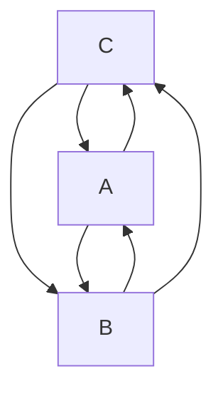

## Всем привет!

Меня зовут Шунько Михаил Геннадьевич я инженер-программист, обучался:

* СШ№1 п. Дружный, до 10 класса.
* Минский Госсударственный Энергетитческий Колледж (2002 - 2006/ТЭС/техник-теплотехник)
* УО Витебский Газ-Институт (2006 котельное и газовое оборудование до ~1Мпа) 
* Белорусский Национальный Технический Университет (2006 - 2012/ФИТР/инженер-программист)
* УО OTUS (ASP.NET Core C# разработчик 2023)

Работал:
* Новополоцкая ТЭЦ. (слесарь-обходчик котельного цеха 4 разряда)
* РУП ОДУ. (техник программист)
* СООО Системные-Технологии.(техник-программист, программист)
* ООО СКЭНД. (ведущий-программист ~не прошел испытательный)
* EMC&RD Lab БГУИР. (инженер-программист)
* Sam-Solutions. (инженер-программист)
* Софт-делюкс. (инженер-программист)

Что если нейросети научить видеть будущее ? Ведь они обучаются на трилионах кусочках информации, связываясь в контекст и интегрально выдают результат, что если обучить их таким образом что бы они выдавали апроксимацию/интерполяцию. Скажем как данные yandex maps могут быть заполнены энтузиастами, так и данные для "предсказания" вы можете отправлять в "Информационно Вычислительный Центр", который анализирует их и предсказывает развитие событий в вашем региончике. Я считаю что это возможно и реально, проект **Сервис сохранения** по английски **mind preservation service** , истоки тянутся к проекту GORCHAN проект СИИ, в котором "мозг" компьютерного агента, подвергался операции "shrink mazafaka", то есть перебирались все хранящиеся в мозгу образы, и те которые не могли "достучаться", т.е не имели "импульса", что бы достичь контекста удалялись.
**Самая главная задача которую они дожны решить - предсказать, т.е предотвратить катастрофу человеческой цивилизации.**

Нейросети отлично видят прошлое, почему бы не научить их видеть приближенное будущее ?

Теперь блок "САСЦЫ ВИДАТЬ" - что могут и что видно в нейросетях. 

[Оригинал](https://chatgpt.com/share/68652f17-3980-8007-86a7-0e885d40fc06) смотреть через Opera с включенным VPN.

[Текущее положение дел](https://chatgpt.com/share/686a0e8d-10ac-8007-819d-7fee1c9063c8) описание состояние вопроса. 

Почему этот проект не появился в США ? Потому что НАТО довело ситуацию в научных отрослях до абсурда, что это значит ? - это значит что все исследования в областях науки НАТО не имеют "свежей крови", все разрабатывается "истовыми-инженерами" вливая в исследования не новизну, а новый вид старых наработок и чего то принципиально нового они физически не могут изобрести.

**Математика проекта**

Главной проблемой современности является информационный поток - это вся та информация которая "производится", "потребляется" и "блуждает" в обществе. Она на прямую влияет на моральное состояние человека и может отыграть в нем различного рода расстройствами или психики, или соматики в случае если процент понимания ее невелик. Так нарушается семантическое представление о мире вокруг и поведение человека изменяется, он еще хочет но уже не может достигнуть своих целей. Это ставит разного рода преграды на жизненном пути, начинает болеть душа и тело, что выливается в произведения культуры (тот же информационный поток) в которых он желает, просит, умоляет о помощи. Понимание информационного потока позволяет "откликнуться" и оказать сколько нибудь значимую помощь. Понимая боль с медиа экранов вы можете "прозреть", бросить всё и убежать в бизнес, оставив остальных на произвол судьбы. Я думаю так делать не надо, а то можно оказаться на распятии, да, да на распятии пологаю что предательство Иуды и "Тайная вечеря" описывают именно это. По этому спокойствие, только спокойствие, за все проекты отвечаете головой, пол дела их обозначить, самое главное превратить их в жизнь.

Рассмотрим семью состоящую из 3 человек, где $x_1$ - папа, $x_2$ - мама, $x_3$ - ребенок. Рассмотрим следующую жизненную ситуацию, мама и папа, мечтают о ребенке и о его будущем. Для того что бы ребенок появился на свет, папа должен обладать мужеством, выдержкой быть целеустремленным, маме необходимо знать все примудрости воспитания ребенка от рождения до того момента когда он станет самостоятельным.

Условие появления ребенка $\LARGE x_3$ на свет , папа должен пожертвовать собой $\LARGE\frac{1}{2}x_1$ - отдать частичку себя, мама должна быть готова стать мамой $\LARGE 2x_2$ выразим в уравнении:

$\LARGE\frac{1}{2}x_1+2x_2=x_3$

Взросление ребенка, папа обязан обеспечить защиту для мамы и ребенка и быть в состоянии их обеспечить всем необходимым, а мама и ребенок просто обязаны сохранить эту любовь, выразим в уравнении:

$\LARGE\frac{x_1}{x_2+x_3}=1$

Самостоятельность ребенка, когда он без родителей может управится, справится с ежедневными делами и при этом не потерять себя, выразим в уравнении:

$\LARGE x_3-(x_2+x_1)=1$

Имеем систему уравнений (1):

$\LARGE\frac{1}{2}x_1+2x_2=x_3$

$\LARGE\frac{x_1}{x_2+x_3}=1$

$\LARGE x_3-(x_2+x_1)=1$

Она необходима для построения модели вычислений проекта **Сервис сохранения**.

Корни: $x_1=-3$ - папа, $x_2=-0.5$ - мама, $x_3=-2.5$ - ребенок. Данная ситуация описывает счасливый семейный уклад.

Далее, пологая что находясь дома в кругу близких людей, боль которых мы никак не можем проигнорировать, попробуем расчитать силу взаимодействия, для этого будем использовать учебное лекало закон Кулона.

$\LARGE F=k*\frac{q_1*q_2}{r^2}$

Пологая что семья не изолирована от остального мира, а ребенок самый уязвимый в этой системе, предположим что он приносит в дом некоторую тревожность, воспринимая ее с улицы или с медиа экранов. Его тревожность вызывает в семье серьезные разговоры, нравоучения, а так же скандалы - если сил противостоять тревожности у семьи нет. A - папа, B - мама, C - ребенок.

Пологая что, восприятие изменяет личностные качества ребенка, что отыгрывает в понижении или увеличении его "самостоятельности", т.е изменяет коэфициент $x_3=-2.5$ радость - в плюс, или ошарашенность - в минус. Решаем систему уравнений заново, с заранее известным $x_3$. Пологая что данная семья непрерывно участвует в жизни страны и находится в обществе таких же семей имеем модель представления о влиянии, распространении, информационного потока.

Следствие:

Когда ребенок рождается здоровым ? - когда соблюдаются условия системы уравнений (1).

Когда ребенок рождается больным ? - когда общество в котором находится семья не в силах противостоять информационному потоку.

**Дальнейшие шаги, прототипирование**

Отталкиваясь от природы света:

(1.) Разложение которого дает вcё множество веществ.

(2.) Конечная точка существования которого - твердое тело.

(3.) Свойства преломления которого наверняка описывают процесс восприятия мозгом образов и сигналов из окружающей среды и приблизительной ее обработки.

Мы сможем подготовить исчерпывающий ответ на запрос к компьютерному агенту - запрос, декомпозируется "разлаживается" именно в ключе преломления света, далее используя алгоритм выполняется композиция ответа который обязан быть понятен оператору. То есть буквально понимание природы света позволяет читать или угадывать мысли на перёд. Что означает - все будет хорошо, помощь рядом, помощь в пути - главное не подвести и выполнить обещание.

Для успешной реализации проекта необходимы, исследования в области природы света, понимание: свет - твердое вещество, свет - мыслительный процесс, мысли - крупицы прошлого.

Необходимые условия - что бы не довести исследования до обсурда, то есть до такой ситуации когда нужно будет учитывать и сумировать 10000000000 мнений и идей учасников проекта и выдавать результат который наверняка станет деградирующим, я предлагаю вести разработку в ограниченном кругу, всем заинтересованным лицам предлагаю гарантии спокойствия. Данный проект должен стать драйвером экономического роста, продолжением дерева промышленного производства страны, которое на данный момент представлено специалистами в области Информационных-технологий и связи. В обязанности специалистов новой эры промышленного производства будет входить обеспечение безопасности в области Информационных-Технологий и связи в ключе информационного потока. Для появления специалистов и професси необходимы: Мир, время (18 лет), оборудование, научная база - например предприятие ОАО ПЕЛЕНГ.

Микро-нано-электроника постепенно исчерпывает себя и доводит себя до абсурда.

Большой адронный коллайдер не стал драйвером научного прогресса, было вложено много, результата 0.

По этому был выбран свет.

 Деградацию науки можно описать диалогом: 

-копия, копия, копия, копия, копия

-Привет Мир

-Сасите хуй
