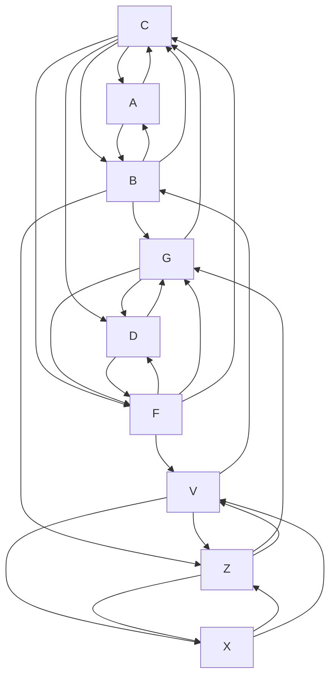

# Всем привет!

Меня зовут Шунько Михаил Геннадьевич я инженер-программист, обучался:

* СШ№1 п. Дружный, до 10 класса.
* Минский Госсударственный Энергетитческий Колледж (2002 - 2006/ТЭС/техник-теплотехник)
* УО Витебский Газ-Институт (2006 котельное и газовое оборудование до ~1Мпа) 
* Белорусский Национальный Технический Университет (2006 - 2012/ФИТР/инженер-программист)
* УО OTUS (ASP.NET Core C# разработчик 2023)

Работал:
* Новополоцкая ТЭЦ. (слесарь-обходчик котельного цеха 4 разряда)
* РУП ОДУ. (техник программист)
* СООО Системные-Технологии.(техник-программист, программист)
* ООО СКЭНД. (ведущий-программист ~не прошел испытательный)
* EMC&RD Lab БГУИР. (инженер-программист)
* Sam-Solutions. (инженер-программист)
* Софт-делюкс. (инженер-программист)

# Сломаный телефон

# Задача 1 - Починить
