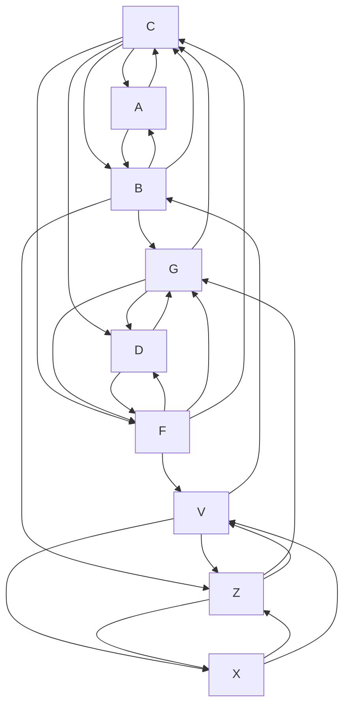

# Сломаный телефон

```mermaid
graph TD;
    C-->A;
    C-->B;
    B-->A;
    A-->B;
    A-->C;
    B-->C;
    C-->D;
    B-->G;
    C-->F;
    G-->D;
    G-->F;
    F-->D;
    D-->F;
    D-->G;
    F-->G;
    F-->C;
    F-->V;
    G-->C;
    V-->B;
    B-->Z;
    Z-->G;
    V-->Z;
    V-->X;
    X-->Z;
    Z-->X;
    Z-->V;
    X-->V;
```

# Задача 1 - Починить
