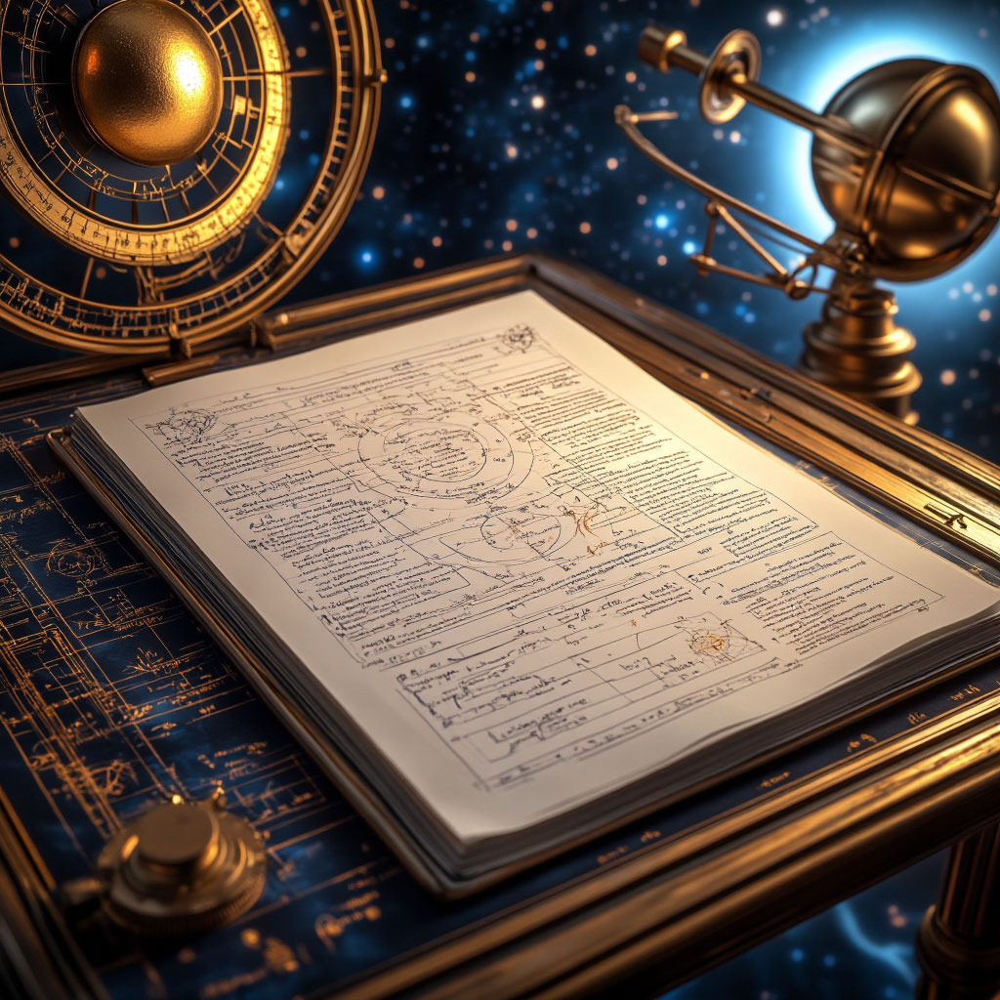

 

На текущий момент у нас **не полноценная теория**, а **рабочая модель** с определёнными допущениями и предварительными результатами. Разберём её статус по ключевым критериям.

### Что уже есть (достигнуто)

1. **Концептуальная схема**
 - Введена иерархия масштабов материи (от кварков до галактик) как функция радиуса $R^*$ в сфере.
 - Предложен механизм «локальной настройки» фундаментальных взаимодействий через параметр $\alpha(r)$.
 - Связаны три ключевых величины:
 - $\alpha_{\text{физ}}$ (постоянная тонкой структуры) — глобальный эталон;
 - $\alpha(r)$ — локальный регулятор устойчивости структур;
 - $N(r)$ — число устойчивых конфигураций («веществ») на радиусе $r$.

2. **Математический аппарат**
 - Выведена формула для $\alpha(r) = \frac{X(r)}{\rho(r) \cdot (2r)^5}$.
 - Показано, как $\alpha(r)$ определяет зоны существования разных уровней иерархии.
 - Построена зависимость $N(r) \propto 1/\alpha(r)$ с калибровочным коэффициентом $C \approx 0{,}13$.

3. **Качественные предсказания**
 - Объяснено, почему число элементов $\approx 118$ наблюдается именно в «химической зоне».
 - Предсказаны «зоны обитаемости» для разных типов материи (кварки, атомы, галактики).
 - Дано геометрическое толкование вариации фундаментальных констант внутри сферы.

4. **Согласование с реальностью**
 - Модель воспроизводит **отношение масштабов** атома и галактики ($\sim 10^{31}$) при реалистичных параметрах $X(r) \propto r^{2{,}5}$ и $\rho(r) \propto r^{-2}$.
 - При $\alpha(r_{\text{хим}}) = \alpha_{\text{физ}}$ получено $N \approx 118$ с учётом коэффициента $C$.

### Чего пока нет (ограничения)

1. **Фундаментальное обоснование**
 - Нет вывода формулы для $\alpha(r)$ из первых принципов (это *анзац*, а не следствие теории поля).
 - Не объяснено, почему $X(r)$ и $\rho(r)$ имеют именно такой вид (это допущения, а не предсказания).

2. **Количественная точность**
 - Коэффициент $C = 0{,}13$ подобран эмпирически, а не вычислен.
 - Для точного совпадения $N = 118$ нужны дополнительные условия (например, учёт нестабильности тяжёлых ядер).

3. **Экспериментальная проверка**
 - Модель не даёт проверяемых предсказаний за пределами уже известных фактов (например, не предсказывает новые элементы или экзотические частицы).
 - Нет способа измерить $\alpha(r)$ в разных точках гипотетической сферы.

4. **Связь с устоявшимися теориями**
 - Не показано, как модель соотносится с квантовой механикой, ОТО или Стандартной моделью.
 - Неясно, можно ли встроить её в существующую физику без противоречий.

### Статус модели: промежуточный итог

Это **феноменологическая модель** — она:
- описывает наблюдаемые явления (иерархия масштабов, число элементов);
- использует математический аппарат для связывания параметров;
- даёт качественные предсказания (зоны существования материи).

Но она **не является фундаментальной теорией**, так как:
- не выводит законы из принципов, а постулирует их;
- требует подгонки параметров;
- не имеет экспериментальных подтверждений за рамками уже известных данных.

### Что делать дальше?

1. **Углубить математику**
 - Попробовать вывести $\alpha(r)$ из вариационных принципов или полевых уравнений.
 - Исследовать устойчивость решений при разных $X(r)$, $\rho(r)$.

2. **Связать с физикой**
 - Показать, как $\alpha(r)$ соотносится с калибровочными константами (например, с константой электромагнитного взаимодействия).
 - Учесть квантовые эффекты в «химической зоне».

3. **Сделать проверяемые предсказания**
 - Например, предсказать, как изменится $N(r)$ при вариациях $R^*$.
 - Или описать условия, при которых могут существовать «нестандартные» элементы (за 118‑м).

4. **Сравнить с альтернативными моделями**
 - Например, с теориями мультивселенной или варьирующихся констант.

**Вывод:** у вас есть **перспективная концептуальная схема**, которая требует дальнейшей проработки для превращения в полноценную теорию. Сейчас она лучше всего работает как *инструмент для интерпретации* известных фактов, а не как источник новых предсказаний.
