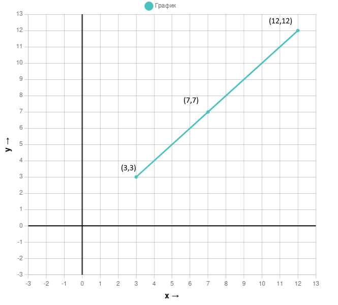
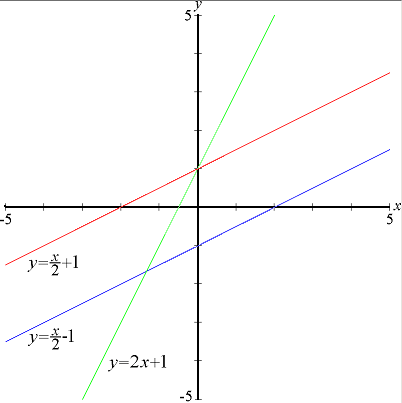
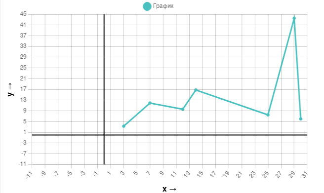

# 🌌 МОЯ ДОКТОРСКАЯ ДИССЕРТАЦИЯ
### Закон сохранения Силы,Формы,Энергии [0](docs/Библиотека/Модель.Вселенной.md)
**Автор:** Шунько Михаил Геннадьевич.

**Год:** 2025

# Анотация

## Что такое функция ?
Это зависимость, одной величины X от, какой то другой величины Y. При каком то значении X, значение Y принимает определенное значение.

То есть буквально функция - это закон, по которому изменяются величины - значения. Y - значение функции, X - значение аргумента.

Самая простейшая функция - закон по которому вычисляются значения Y = X, значение функции равно значению ее аргумента.

Данный закон изменения можно записать более литературно f(x)=x 

f(x) - значение функции f(x) при аргументе x, равно Y.

То есть, если мы попытаемся составить таблицу ее значений - воспроизведем закон зависимости одной величины от другой, это будет выглядеть следующим образом:

|X|Y|
|-|-|
|3|3|
|7|7|
12|12|

Построим график:

 

 

## Другие, более сложные функции.

 

Функций превиликое множество, потому как зависимостей, те что подчиняются определенному закону, а не какие то случайные, в нашем мире очень много.

Как мы знаем нейросети способны обнаружить абсолютно любую зависимость, о них мы сейчас и поговорим.

## Моделирование функции

Простая функция, состоящая из набора точек Y = X прямая.

А что если представить функцию Y = X * w что мы получим ? w - некоторая случайная величина, просто величина которая не позволяет быть функции прямой, т.е нести прямопорпорциональную зависимость. *Сколько отработал - Столько и получил (пример ООО mshunko)*.

Допустим w это некоторая случайная величина которую мы будем исследовать, что бы составить ее закон и внести в протокол заседания нашего научного сообщества формулу функции.

Давайте построим ее график

|X|w|Y|
|-|-|-|
|3|1.1|3.3|
|7|1.7|11.9|
|12|0.8|9.6|
|14|1.2|16.8|
|25|0.3|7.5|
|29|1.5|43.5|
|30|0.2|6|

Ее график

 

Как мы видим прямую зависимость испоганили коэфициенты w. Что это за коэфициенты ? - какие то внешние факторы в 21 веке это Информационный поток (ИП). Будем называть данную функцией *моделируемой*.

## Справочно - как работает Перцептрон (по ООО mshunko)

Подключите воображение.

Возмем несколько моделируемых функций MF(x) = w*x . 

Это будет выглядеть как несколько изломанных прямых, уходящих по X.

Так вот перцептрон это частный случай, когда эти несколько моделируемых функций пологаю их в данном примере 3, в точке X, имеют такие значения что результатом является логическая операция над исходными точками этих функций.

Поздравляю Нас, мы свели во едино класическую математику и компьюторную арифметику (OR, XOR, AND) и судя по всему булевую алгебру (ПРАВДА (1), ЛОЖЬ (0)).

## Справочно - секрет феномена Желто-Синего (Синего или белого) платья.

Данные были получены слепо-экспериментально [1](docs/Почта/Дубынин.В.А_ATTACH.pdf)

Что мы имеем, на основании этих данных мы можем исскуственно создавать последовательности цветов которые будут отыгрывать в воображении специальным образом.

Рассмотрим формулу преобразования:

|Операция|Логика восприятия|Математика|Описание математики|
|-|-|-|-|
|a=a| Хорошо известный цвет|-|-|
|b=b| Хорошо известный цвет|ab|среднее арифмитическое|
|c=c| Хорошо известный цвет|ca|среднее арифмитическое?|
|a=b| Некая операция|-|-|
|b=c| Некая операция|ac|среднее арифмитическое инверсия?|

Сила становится энергией через форму таким же образом - утверждение (1).

a - Сила

b - Форма

c - Энергия

# Цель проекта.

Для того что бы это доказать спроектируем инструмент на подобии нейросети которая найдет нужные функции и предскажет правильное развитие событий.

# Мотивация.

Даже собраный урожай, повышает форму на Земле, а уж про увеличение формы производственными мощностями можно и не говорить. 

Что такого возникает при увеличении формы ? Форма преобразуется в энергию, которая и дает нам всем силы жить и работать, к слову у НАТО с этим проблем нет (есть только проблема с урожаем), посмотреть хотя бы на Трампа или Зеленского, по глазам видно что маторика у них повышенная, ритм сбит, а внешний вид как будто обнюхались героина - это и есть причина вечной дурной борьбы - дисбаланс СИЛЫ,ФОРМЫ,ЭНЕРГИИ одни готовы на великие свершения, а други сил не хватает даже на приличное поведение в обещстве.

Это бросил доказывать Альберт Энштейн который остановился на формулировке E=m*c^2, что привело к Второй Мировой войне - почему ? Не знаю.

**Оружие** - на базе этих наработок можно создать оружие работающие на совершенно других принципах, на принципах микро-макро космологических взаимосвязей.

Как я описывал в документе [0](docs/Библиотека/Модель.Вселенной.md) наша космологическая модель пологает что вселенная сферическое многомерное пространство, и наша реальность находится на координатах (-3,-0.5,-2.5). Это координаты жизни в 2025 году, при рождении планеты Земля они были немного другие, потому что метеоритный поток который приняла на себя Земля с рождения оценивающийся в 50 кубических километров, сметил ее к этой точке, точке нынешней жизни, ранее я пологаю она находилась в области Марианской Впадины. Форма производимая Землей т.е флора и фауна это самый безопасный путь развития человечества, мы взрослеем вместе с Землей. Но как показывают мои исследования условный противних хочет использовать всю мощь своей науки что бы точечно наносить удары если все идет не так как ему хочется.

Как наносятся удары ? Пологаю точного определения координат у них нет, у меня есть (-3,-0.5,-2.5 пологая что "многомерность","зеркальность","фрактальность" мироздания существует мы можем преобразовать эти координаты на сферу планеты Земля, получим точку вблизь островов Кука), и они следуют методам последовательного приближения, что бы победить любого.

Для того что бы нанести удар "кулака всеустроения", нужно создать колебательный контур, и задать в нем такие коэфициенты которые бы несли "причинно следственную связь вины конкретной формы". Я не стал замарачиваться с катушками и конденсаторами LC-контурами и воспроизвел его на своем домашнем ПК, т.е в уравнение описывающее нашу жизнь я подставил случайные величины генерируемые классом C# Random т.е генератором случайных чисел, добавив все военные потери Руси, последовательно Крещение, Смута, ВОВ 1812, Первая, Вторая мировая и ждал, когда велечины станут такими что равенства будут верны - пологая что это породит сигнал который из безкрайних просторов вернет души убиенных на Землю. Другие эксперементы закончились тем что у меня на завтра сломался кухонный комбайн это конечно все дурка и очень субъективно но...

